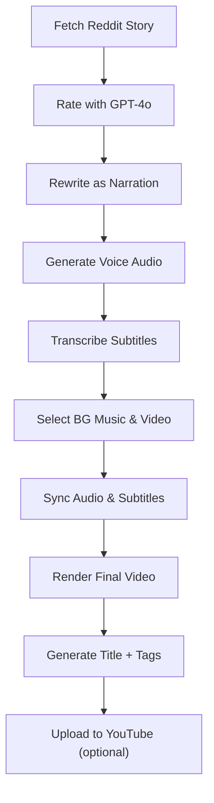

# 🎬 K100DRA — AI-Powered Reddit Video Generator

Scripting content creation using Python and AI

[YOUTUBE](https://www.youtube.com/@k100dra5/shorts) :: https://www.youtube.com/@k100dra5/shorts

K100DRA is an end-to-end, automated pipeline that transforms Reddit stories into engaging YouTube-ready videos using AI. It fetches Reddit posts, rewrites them into scripts using GPT-4o, generates voiceovers, adds subtitles, syncs visuals and music, and optionally publishes the final result.

Perfect for creating Shorts, TikToks, or full YouTube content—hands-free.

---

## ⚙️ Features

* 🧠 **GPT-4o Enhanced**: Story rewriting, audio synthesis, subtitle correction, and YouTube metadata generation.
* 🔥 **Automatic Reddit Post Fetching**: Pulls and rates posts from subreddits like `TIFU`, `AITA`, `FanTheories`, etc.
* 🗣️ **Voice Generation**: Creates high-quality narration via TTS (Text-To-Speech).
* 🎵 **Background Audio Syncing**: Merges voiceover with music.
* 📼 **Video Assembly**: Crops and matches background video to the audio duration.
* 📝 **Subtitles**: Transcribes audio to `.srt`, auto-fixes sync issues.
* 🚀 **Ready-to-Publish Output**: Upscales to 4K and can auto-upload to YouTube.

---

## 🧪 Pipeline Overview

<details>
<summary>📊 Pipeline Flow (click to expand)</summary>



</details>

---

## 🛠️ Requirements

* Python 3.10+
* `pydub`
* `argparse`
* `ffmpeg`
* OpenAI API key (used via `k_gpt4o`)
* Other internal modules: `k_reddit`, `k_srt`, `k_movie`, `k_youtube`

---

## 🧰 How to Use

### 🔁 Run the Full Pipeline

```bash
python MAIN.py
```

### 🧪 Use an Existing Project Again

```bash
python MAIN.py --project
```

### ⛔ Skip Individual Steps (for testing)

```bash
python MAIN.py --bp_r       # Skip Reddit fetching
python MAIN.py --bp_s       # Skip GPT storytelling
python MAIN.py --bp_a       # Skip audio generation
```

### 📅 Upload Scheduling

`k_youtube.py` keeps a list of upload hours (``UPLOAD_TIMES``) and by default
posts at **10:00** and **16:00** every day.  It checks `upload_time.json` for
the previously scheduled slot and picks the next hour from the list; when all
times for the day are used, scheduling rolls over to the first slot of the next
day.  The file is updated after each call so uploads remain evenly spaced.

---

## 📂 Folder Structure

```
K100DRA/
│
├── MAIN.py
├── projects/              ← Generated projects with audio, srt, video, etc.
├── videos/                ← Background video pool
├── musics/                ← Background music pool
├── k_reddit.py            ← Reddit scraper
├── k_gpt4o.py             ← GPT + TTS handler
├── k_movie.py             ← Video editor utils
├── k_srt.py               ← Subtitle processor
├── k_youtube.py           ← Upload script
└── links.txt              ← Prevent reposting same stories
```

---

## 🧠 Subreddits Supported

Pulls posts from a rotating pool of quality storytelling subs:

```
TrueOffMyChest, todayilearned, TIFU, confessions, FanTheories,
TalesFromRetail, decidingtobebetter, FML, AITA, BestofRedditorUpdates,
MadeMeSmile, funfacts, UnpopularOpinion, and more...
```

---

## DOT ENV 
```env
KEY_OPENAI = sk-proj-xxxx
REDDIT_CLIENT_ID = xxxx
REDDIT_CLIENT_SECRET = xxxx
REDDIT_USER_AGENT = K100DRA
```
