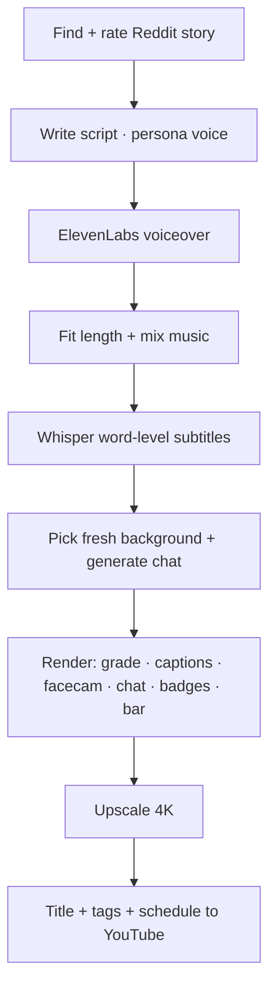

# 🎬 K100DRA — AI Short-Form Video *Creator*

Not a dumb auto-generator — **a character with a recognizable format.** Every
K100DRA short is framed as a **CLIP from her live stream**: she's a high-energy
streamer reading a wild story to her chat, reacting in real time, with her
**profile-pic facecam, a live-chat overlay, and "LIVE / CLIP" badges** on screen
so viewers recognize her instantly. You watch the whole thing get made live in a
custom studio dashboard.

[YOUTUBE → https://www.youtube.com/@k100dra5/shorts](https://www.youtube.com/@k100dra5/shorts)

---

## 🚀 Start here

```bash
python run.py
```

On the **first run** this guides you through setting *everything* up — pasting
your API keys, connecting YouTube — and **verifies every key is valid** before
launching. On later runs it re-checks your keys and opens the studio. From the
dashboard press **Start** for a real run, or **✨ Demo** to watch the entire
pipeline run end-to-end with **no keys and no ffmpeg**.

```bash
python run.py --reconfigure   # re-enter every key
python run.py --studio        # skip the menu → dashboard
python run.py --headless      # skip the menu → make one video in the terminal
```

---

## ✨ What's new in v2

| Area | Before | Now |
| --- | --- | --- |
| **Identity** | generic "influencer" prompt | a **streamer-clipped-from-her-stream** format — talks to chat, reads chat, signature sign-off ("…that's the clip") |
| **On-screen brand** | none | **facecam profile pic**, handle nameplate, **live-chat overlay**, LIVE/CLIP badges |
| **Voice** | OpenAI `tts-1` | **ElevenLabs**, tuned for big intonation/emphasis (with automatic OpenAI fallback) |
| **Captions** | flat one-word MoviePy text | **animated word-by-word captions** — the spoken word pops & lights up in the brand colour |
| **Visuals** | plain crop | colour grade, subtle motion, retention **progress bar** |
| **Backgrounds** | random local file + random start | **YouTube links** (download just the segment, then delete — no clutter) *or* local pool, with smart least-recently-used + fresh-segment selection |
| **UI** | a `tqdm` bar | a **live web studio**: streaming script, audio + video previews, live chat, per-stage bars + ETA |
| **Setup** | edit `.env` by hand | a **guided wizard** that inputs keys, connects Google, and validates everything |

---

## 🖥️ The Studio directly

```bash
python run_studio.py            # → http://127.0.0.1:8000
python run_studio.py --open     # and open the browser for me
```

Then press **Start** for a real run, or **✨ Demo** to watch the entire pipeline
simulate end-to-end (no keys/ffmpeg required — great for a first look).

The dashboard shows, in real time:

```
┌─ K100DRA STUDIO ─────────────────────────── ● live ─┐
│ Script ✓   Voice ⟳   Audio ·  Subs ·  Video ·  Pub ·│
│ Overall ▰▰▰▰▰▰▱▱▱▱ 62%   elapsed 1m02s · ~38s left   │
│                                                      │
│ Script:  "So she found a second phone taped under…"  │  ← streams in as it's written
│ Voice & audio:  ▶ speech_with_music.mp3              │  ← play it back
│ Video:  🎬 video_final.mp4                            │  ← preview the result
│ Activity: ▸ Found r/TIFU · 9/10 · writing script…    │
└──────────────────────────────────────────────────────┘
```

---

## 🎭 The Persona — a streamer, clipped

Everything the channel "is" lives in [`k100dra/persona.py`](k100dra/persona.py):
the **stream-clip format**, how she talks *to chat*, her catchphrases
(`"Chat. CHAT. You are not ready for this one."` → `"…that's the clip. That's
going on the channel."`), hooks, closers and taste. Those build the prompts for
**scriptwriting, story rating, the live-chat reactions and metadata**, so editing
the persona restyles the whole channel at once.

The look that makes her recognizable is in `VisualStyle` (in
[`k100dra/config.py`](k100dra/config.py)): `facecam`, `handle`, `chat_overlay`,
`live_badge`, `clip_badge`, plus caption colours and the accent.

Want to tweak her without touching code? Generate an editable copy:

```python
from k100dra.persona import persona
persona.save_template()     # writes persona.json — edit it, it's auto-loaded
```

---

## ⚙️ Setup

**The easy way:** just run `python run.py` — the wizard installs dependencies,
prompts for each key, connects YouTube and validates everything. The manual
reference below is only if you'd rather configure it yourself.

### 1. Install

```bash
pip install -r requirements.txt
# ffmpeg + ffprobe must also be installed and on your PATH
```

### 2. Configure `.env`

```env
# Text (required)
KEY_OPENAI=sk-proj-xxxx
# Script model (default gpt-5.5; falls back to gpt-4o if unavailable).
# Any id works — set a "claude-*" id (and ANTHROPIC_API_KEY) to use Claude.
K100DRA_MODEL_STORY=gpt-5.5

# Voice (recommended — falls back to OpenAI TTS if missing)
ELEVENLABS_API_KEY=xxxx
ELEVENLABS_VOICE_ID=21m00Tcm4TlvDq8ikWAM      # default: "Rachel"
# Tip: pick the voice visually in the studio → Sources tab (or the setup
# wizard) — it lists the voices on your ElevenLabs account and sets this for you.

# Reddit source (required for real runs)
REDDIT_CLIENT_ID=xxxx
REDDIT_CLIENT_SECRET=xxxx
REDDIT_USER_AGENT=K100DRA

# Optional tuning
K100DRA_AUTO_UPLOAD=true
K100DRA_TARGET_DURATION=59
```

YouTube upload is optional: drop your OAuth client `youtube.json` at the repo
root (a `token.json` is created on first authorisation).

### 3. Add backgrounds & music

Two ways to provide background footage (the selector handles variety,
anti-repeat and length-matching either way):

* **YouTube links — no local clutter (recommended).** Copy
  `backgrounds.example.txt` → `backgrounds.txt`, paste in many YouTube URLs
  (long, calm, copyright-safe footage), and `pip install yt-dlp`. For each
  render K100DRA downloads **only the ~60s segment it needs** and **deletes it
  afterwards**, so nothing piles up on your drive.
* **Local files.** Drop vertical (or large) clips into `videos/`.

Control it in `.env`:

```env
K100DRA_BG_SOURCE=auto      # links if backgrounds.txt has any, else videos/ (default)
K100DRA_BG_SOURCE=youtube   # always use the links
K100DRA_BG_SOURCE=local     # always use the videos/ folder
K100DRA_KEEP_BG=false       # keep downloaded segments instead of deleting (default: delete)
```

Put music in `musics/`.

---

## 🧰 Usage

| Command | What it does |
| --- | --- |
| `python run.py` | **Guided setup + launch** (start here) |
| `python run.py --reconfigure` | Re-run setup, re-enter every key |
| `python run_studio.py` | Launch the live studio dashboard |
| `python main.py` | Make one video, headless |
| `python main.py -n 5` | Make five |
| `python main.py --no-upload` | Render but don't upload |
| `python main.py --demo` | Simulate a run (no keys/ffmpeg) |
| `python main.py --cpu` | Force CPU encoding |
| `python batch_run.py -n 10` | Normalize music, then batch-generate |

---

## 🩺 Logs & troubleshooting

Every run writes a full log (including complete ffmpeg output) that **resets each
run**:

* `logs/latest.log` — the most recent run
* `projects/<project>/run.log` — kept with each project

In the studio, click **"view full log ↗"** in the Activity panel. If a render
fails, the full ffmpeg error is in there.

---

## 🧪 Pipeline


```mermaid
graph TD;
  A[Find + rate Reddit story] --> B[Write script · persona voice];
  B --> C[ElevenLabs voiceover];
  C --> D[Fit length + mix music];
  D --> E[Whisper word-level subtitles];
  E --> F[Pick fresh background + generate chat];
  F --> G[Render: grade · captions · facecam · chat · badges · bar];
  G --> H[Upscale 4K];
  H --> I[Title + tags + schedule to YouTube];
```

---

## 📂 Layout

```
K100DRA/
├── run.py                   ← guided setup + launch (start here)
├── run_studio.py            ← launch the dashboard directly
├── main.py                  ← headless runner
├── k100dra/
│   ├── config.py            ← settings, paths, visual identity, readiness
│   ├── persona.py           ← the streamer persona (edit me!)
│   ├── setup_wizard.py      ← first-run setup + key validation
│   ├── pipeline.py          ← orchestrates everything, emits progress
│   ├── demo.py              ← simulated run for the UI
│   ├── events.py            ← stage/progress model
│   ├── llm.py               ← OpenAI: rate · script · chat · metadata · srt
│   ├── voice.py             ← ElevenLabs voice (+ OpenAI fallback)
│   ├── subtitles.py         ← Whisper word-level timing
│   ├── selector.py          ← smart background + music selection
│   ├── youtube_bg.py        ← on-demand YouTube background segments (yt-dlp)
│   ├── video.py             ← visual engine (captions, facecam, chat, render)
│   ├── youtube.py           ← upload + scheduling
│   └── web/                 ← FastAPI server + dashboard (HTML/CSS/JS)
├── videos/  musics/  fonts/  imgs/
└── requirements.txt
```

---

## 🛠️ Requirements

Python 3.10+, `ffmpeg`/`ffprobe`, and the packages in `requirements.txt`
(FastAPI, OpenAI, praw, pydub, requests, Google API client).
