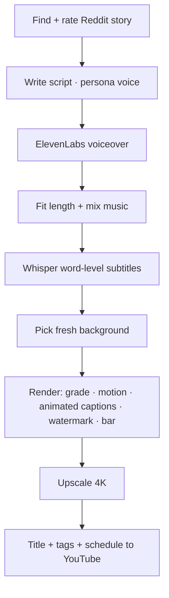

# 🎬 K100DRA — AI Short-Form Video *Creator*

Not a dumb auto-generator — a character. K100DRA turns a Reddit story into a
fully **scripted, voiced, captioned and branded vertical video**, in the voice
of a consistent on-channel persona, and lets you **watch every step happen live**
in a custom studio dashboard.

[YOUTUBE → https://www.youtube.com/@k100dra5/shorts](https://www.youtube.com/@k100dra5/shorts)

---

## ✨ What's new in v2

| Area | Before | Now |
| --- | --- | --- |
| **Personality** | generic "influencer" prompt | a defined [persona](#-the-persona) (voice, hooks, taste) driving *every* prompt |
| **Voice** | OpenAI `tts-1` | **ElevenLabs** narration (with automatic OpenAI fallback) |
| **Captions** | flat one-word MoviePy text | **animated word-by-word captions** — the spoken word pops & lights up in the brand colour, thick outline + shadow |
| **Visuals** | plain crop | colour grade, subtle motion, brand watermark, retention **progress bar** |
| **Backgrounds** | random file + random start | **smart selection**: least-recently-used clip, fresh segment, length-matched |
| **UI** | a `tqdm` bar | a **live web studio**: script streaming in, audio + video previews, per-stage bars, overall bar + ETA, activity log |
| **Run it dry** | — | **demo mode** — watch the whole UI work with no API keys and no ffmpeg |

---

## 🖥️ The Studio

```bash
python run_studio.py            # → http://127.0.0.1:8000
python run_studio.py --open     # and open the browser for me
```

Then press **Start** for a real run, or **✨ Demo** to watch the entire pipeline
simulate end-to-end (no keys/ffmpeg required — great for a first look).

The dashboard shows, in real time:

```
┌─ K100DRA STUDIO ─────────────────────────── ● live ─┐
│ Script ✓   Voice ⟳   Audio ·  Subs ·  Video ·  Pub ·│
│ Overall ▰▰▰▰▰▰▱▱▱▱ 62%   elapsed 1m02s · ~38s left   │
│                                                      │
│ Script:  "So she found a second phone taped under…"  │  ← streams in as it's written
│ Voice & audio:  ▶ speech_with_music.mp3              │  ← play it back
│ Video:  🎬 video_final.mp4                            │  ← preview the result
│ Activity: ▸ Found r/TIFU · 9/10 · writing script…    │
└──────────────────────────────────────────────────────┘
```

---

## 🎭 The Persona

Everything the channel "is" lives in [`k100dra/persona.py`](k100dra/persona.py):
her voice rules, example hooks, closers and taste. Those build the prompts for
**scriptwriting, story rating and metadata**, so editing the persona restyles the
whole channel at once.

Want to tweak her without touching code? Generate an editable copy:

```python
from k100dra.persona import persona
persona.save_template()     # writes persona.json — edit it, it's auto-loaded
```

---

## ⚙️ Setup

### 1. Install

```bash
pip install -r requirements.txt
# ffmpeg + ffprobe must also be installed and on your PATH
```

### 2. Configure `.env`

```env
# Text (required)
KEY_OPENAI=sk-proj-xxxx

# Voice (recommended — falls back to OpenAI TTS if missing)
ELEVENLABS_API_KEY=xxxx
ELEVENLABS_VOICE_ID=21m00Tcm4TlvDq8ikWAM      # default: "Rachel"

# Reddit source (required for real runs)
REDDIT_CLIENT_ID=xxxx
REDDIT_CLIENT_SECRET=xxxx
REDDIT_USER_AGENT=K100DRA

# Optional tuning
K100DRA_AUTO_UPLOAD=true
K100DRA_TARGET_DURATION=59
```

YouTube upload is optional: drop your OAuth client `youtube.json` at the repo
root (a `token.json` is created on first authorisation).

### 3. Add backgrounds & music

Put vertical (or large) clips in `videos/` and music in `musics/`. The selector
takes care of variety and length-matching.

---

## 🧰 Usage

| Command | What it does |
| --- | --- |
| `python run_studio.py` | Launch the live studio dashboard |
| `python main.py` | Make one video, headless |
| `python main.py -n 5` | Make five |
| `python main.py --no-upload` | Render but don't upload |
| `python main.py --demo` | Simulate a run (no keys/ffmpeg) |
| `python main.py --cpu` | Force CPU encoding |
| `python batch_run.py -n 10` | Normalize music, then batch-generate |

---

## 🧪 Pipeline


```mermaid
graph TD;
  A[Find + rate Reddit story] --> B[Write script · persona voice];
  B --> C[ElevenLabs voiceover];
  C --> D[Fit length + mix music];
  D --> E[Whisper word-level subtitles];
  E --> F[Pick fresh background];
  F --> G[Render: grade · motion · animated captions · watermark · bar];
  G --> H[Upscale 4K];
  H --> I[Title + tags + schedule to YouTube];
```

---

## 📂 Layout

```
K100DRA/
├── run_studio.py            ← launch the dashboard
├── main.py                  ← headless runner
├── k100dra/
│   ├── config.py            ← settings, paths, visual style, readiness
│   ├── persona.py           ← the channel's voice (edit me!)
│   ├── pipeline.py          ← orchestrates everything, emits progress
│   ├── demo.py              ← simulated run for the UI
│   ├── events.py            ← stage/progress model
│   ├── llm.py               ← OpenAI: rate · script (streamed) · metadata · srt
│   ├── voice.py             ← ElevenLabs voice (+ OpenAI fallback)
│   ├── subtitles.py         ← Whisper word-level timing
│   ├── selector.py          ← smart background + music selection
│   ├── video.py             ← the visual engine (ASS captions, grade, render)
│   ├── youtube.py           ← upload + scheduling
│   └── web/                 ← FastAPI server + dashboard (HTML/CSS/JS)
├── videos/  musics/  fonts/  imgs/
└── requirements.txt
```

---

## 🛠️ Requirements

Python 3.10+, `ffmpeg`/`ffprobe`, and the packages in `requirements.txt`
(FastAPI, OpenAI, praw, pydub, requests, Google API client).
